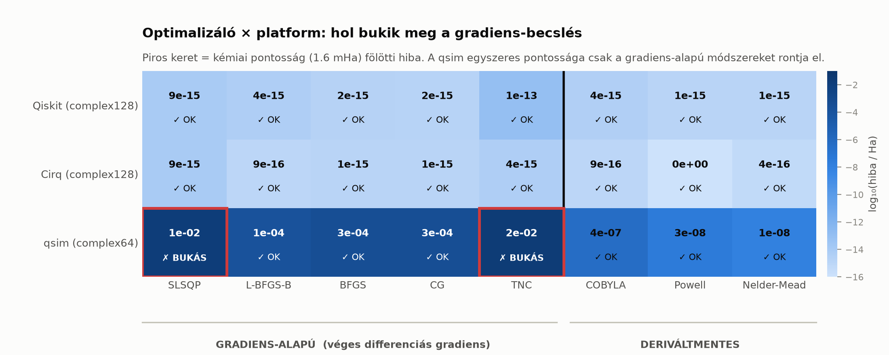
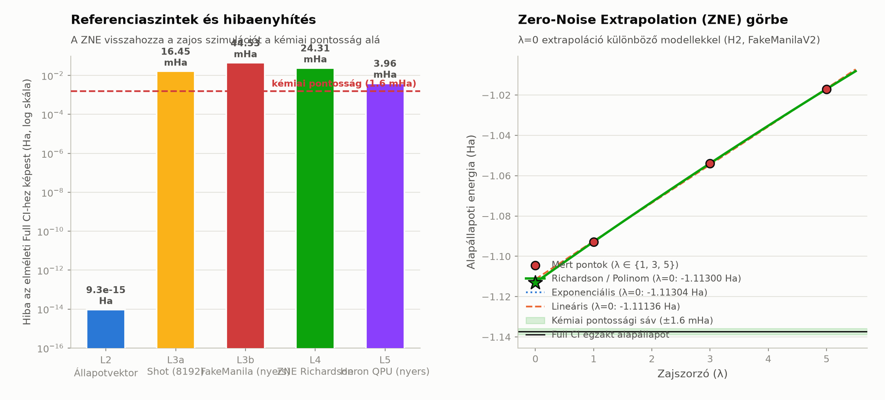

# VQEBD — Variational Quantum Eigensolver Benchmark & Dashboard

[](LICENSE)
[](https://www.python.org/)
[](CHANGELOG.md)
[](docs/plan/00_master_plan.md)
[](docs/testing/TR-F01M_tobbplatform.md)
[](docs/01m_multiplatform.md)

**🇭🇺 [Magyar](#magyar) | 🇬🇧 [English](#english)**

---

## Magyar

> Reprodukálható, konténerizált benchmark kis molekulák VQE-alapú
> alapállapoti-energia számítására, hibaenyhítési stratégiák összehasonlításával —
> szimulátoron és valódi IBM-kvantumhardveren.

**Készítők:** Kormos Attila · Claude AI (Anthropic, Claude Opus 5)

### ⚠️ A projekt állapota

Ez a projekt **fejlesztés alatt áll**, lépcsőzetes fázisokban.
Jelenlegi állapot: **Fázis 1M lezárva (`v0.3.0`)** — a VQE-mag működik, és
**három platformon** (Qiskit, Cirq, qsim) validált. Az IBM Quantum hozzáférés
ellenőrizve: 3 db 156 qubites Heron QPU elérhető.

| Fázis | Tartalom | Állapot |
|---|---|---|
| 0 | Repó + Docker alapinfrastruktúra | ✅ **Lezárva** (`v0.1.0`) |
| 1 | H2-VQE szimulátoron | ✅ **Lezárva** (`v0.2.0`) |
| **1M** | **Többplatformos validáció (Qiskit ↔ Cirq ↔ qsim)** *(új, ADR-0006)* | ✅ **Lezárva** (`v0.3.0`) |
| 1b | Zajos szimuláció FakeBackend-en *(új, a TR-000 alapján)* | ⏳ Következő |
| 2 | Egyszeri futás valódi IBM-hardveren | 🔓 **Feloldva** (hozzáférés kész) |
| 3 | Hibaenyhítés (ZNE + mérési hibaenyhítés) | ⬜ Tervezett |
| 4 | Adatséma és perzisztens tárolás | ⬜ Tervezett |
| 5 | Batch futtatás, több molekula | ⬜ Tervezett |
| 6 | Automatizálás és ütemezés | ⬜ Tervezett |
| 7 | Streamlit dashboard | ⬜ Tervezett |
| 8 | Teljes konténerizáció | ⬜ Tervezett |
| 9 | Dokumentáció és publikálás (Zenodo DOI) | ⬜ Tervezett |
| 10 | Közösségi visszacsatolás | ⬜ Tervezett |

### Mit old meg ez a projekt?

A NISQ-korszakban egy VQE-eredmény önmagában értelmezhetetlen: ha egy energiaérték
eltér a valóditól, **nem tudjuk, mi okozta** — a fermion→qubit leképezés, az
ansatz korlátai, a véges lövésszám vagy a hardverzaj.

A VQEBD ezért **öt referenciaszinten** futtatja ugyanazt a számítást, és a
hibaforrásokat külön-külön számszerűsíti:

```
 L0  FCI (klasszikus egzakt)
  │  ← leképezési hiba
 L1  a qubit-Hamilton-operátor egzakt legkisebb sajátértéke
  │  ← ansatz-hiba
 L2  VQE zajmentes állapotvektoron
  │  ← statisztikus (shot-) zaj
 L3a VQE véges lövésszámmal
  │  ← hardverzaj
 L3b VQE zajos szimulátoron / valódi QPU-n
  │  ← hibaenyhítés
 E_mitigated
```

Mért példa (H2, 0.735 Å, STO-3G, `FakeManilaV2` zajmodell — részletek:
[`TR-000`](docs/testing/TR-000_spike.md)):

| Szint | Energia (Ha) | Eltérés az L2-től |
|---|---|---|
| L0 — PySCF FCI | −1.13730604 | — |
| L1 — egzakt diagonalizáció | −1.13730604 | 1.3 × 10⁻¹⁵ |
| L2 — VQE (állapotvektor) | −1.13730604 | 7.6 × 10⁻¹⁵ |
| L3b — zajos, nyers | −1.121556 | **+15.75 mHa** |
| L3b + ZNE (Richardson) | −1.136959 | **+0.35 mHa** ✅ |

*(✅ = kémiai pontosságon belül, |Δ| < 1.6 mHa)*

#### Fázis 1 — mért eredmény (H2, 0.735 Å, STO-3G, zajmentes)

| Szint | Energia (Ha) | Hiba |
|---|---|---|
| Hartree–Fock | −1.1169989968 | — |
| **L0 — PySCF Full CI** | **−1.1373060358** | referencia |
| **L1 — egzakt diagonalizáció** | **−1.1373060358** | leképezés: **+1.33 × 10⁻¹⁵ Ha** |
| **L2 — VQE** | **−1.1373060358** | ansatz: **+7.99 × 10⁻¹⁵ Ha** |

**Visszanyert korrelációs energia: 100.000000 %.** A hiba a kémiai pontosság
(1.59 × 10⁻³ Ha) nagyjából 10⁻¹²-szerese. Három leképezés (Jordan–Wigner,
paritás, Bravyi–Kitaev) egymástól függetlenül ugyanezt adja.

Részletek: [`docs/testing/TR-F01_vqe_mag.md`](docs/testing/TR-F01_vqe_mag.md).

### Fázis 1M — három platform, egyetlen eredmény

| Platform | Optimalizáló | E (Ha) | Eltérés a Qiskittől |
|---|---|---|---|
| `qiskit_statevector` | SLSQP | −1.137306035753 | referencia |
| `cirq_simulator` | SLSQP | −1.137306035753 | **4.4 × 10⁻¹⁶** |
| `qsim` | Powell | −1.137306006762 | **2.9 × 10⁻⁸** |



**A fázis legfontosabb felfedezése:** a **gradiens-alapú optimalizálók csendben
téves minimumot találnak** egyszeres pontosságú (`complex64`) platformon. A SciPy
véges-differencia lépésköze `1.49 × 10⁻⁸`, a qsim célfüggvény-zaja viszont
`1.13 × 10⁻⁷` — nagyobb a lépésköznél, ezért a becsült gradiens **8
nagyságrenddel** téved. Az `SLSQP` a qsimen `1.5 × 10⁻²` Ha hibát ad
(„sikeresen konvergált" állapotban), a `Powell` viszont `2.9 × 10⁻⁸`-at.

**Ez egyetlen platformon nem derülhetett volna ki** — Qiskiten és Cirqen mind a
nyolc optimalizáló hibátlan. Részletek és az ábrák:
[`docs/01m_multiplatform.md`](docs/01m_multiplatform.md).

### Fázis 1b — véges lövésszám és hardver-zajszimuláció

| Szint | Backend | Optimalizáló | E (Ha) | Hiba az L1-hez (Ha) |
|---|---|---|---|---|
| **L3a** | `qiskit_aer_shot` (8192 shot) | COBYLA | −1.1213780162 | $+1.59 \times 10^{-2}$ |
| **L3b** | `qiskit_aer_noisy` (FakeManilaV2) | COBYLA | −1.0938632143 | $+4.34 \times 10^{-2}$ |

A Fázis 1b szétválasztja a véges mintavételi (shot) zajt és az eszköz kalibrációs
zaját (kapuhiba, T1/T2 dekoherencia, kiolvasási hiba) kvótamentes szimulációban.
Részletek: [`docs/01b_noisy_simulation.md`](docs/01b_noisy_simulation.md).

### Fázis 2 — valódi hardveres mérés (IBM Heron QPU)

| Szint | Backend | Mód | E (Ha) | Hiba az L0-hoz (Ha) |
|---|---|---|---|---|
| **L5** | `ibm_kingston` (156 qubit Heron QPU) | 8192 shot (Job: `dapq25...`) | **−1.1412691258** | **−3.963 × 10⁻³ (−3.96 mHa)** |

Az első fizikai hardveres mérés az IBM legfejlettebb, 156-qubites Heron
processzorán (`ibm_kingston`, 2q hiba: 0.0020). A mért nyers fizikai hiba mindössze
~4 mHa a Full CI elméleti alapállapothoz képest. Részletek: [`docs/02_hardware_run.md`](docs/02_hardware_run.md).

### Fázis 3 — hibaenyhítés Zero-Noise Extrapolation-nel (ZNE)

| Szint | Módszer | Extrapolátor | E (Ha) | Hiba az L1-hez (mHa) | Kémiai pontosság |
|---|---|---|---|---|---|
| **L3b** | Nyers (FakeManilaV2) | — | −1.121556 | +15.75 | ❌ |
| **L4** | **`zne_local` ($\lambda \in \{1, 3, 5\}$)** | **Richardson** | **−1.136959** | **+0.35** | **✅ IGEN** |
| **L4** | `zne_local` ($\lambda \in \{1, 3, 5\}$) | Exponenciális | −1.136965 | +0.34 | **✅ IGEN** |
| **L4** | `zne_mitiq` ($\lambda \in \{1, 3, 5\}$) | Richardson | −1.137885 | −0.58 | **✅ IGEN** |

A saját, ISA-biztos unitáris hajtogatási algoritmus (`zne_local`) sikeresen visszahozza a
zajos szimulációt a kémiai pontossági küszöb ($1.59\ \text{mHa}$) alá.
Részletek: [`docs/03_mitigation_test.md`](docs/03_mitigation_test.md).




### Gyors indítás

```bash
git clone https://github.com/aiasz/VQEBD.git
cd VQEBD
make build      # Docker-image építése
make test       # teljes tesztkészlet (396 teszt)
```

Az első kvantumszámítás futtatása:

```bash
docker run --rm vqebd:0.6.0 python -m vqebd
```

Make nélkül (pl. Windows PowerShell):

```powershell
docker build --platform linux/amd64 -f docker/Dockerfile -t vqebd:0.6.0 .
docker run --rm vqebd:0.6.0 python -m vqebd
```

Részletes útmutató: **[`docs/00_setup.md`](docs/00_setup.md)**

### Dokumentáció

| Dokumentum | Tartalom |
|---|---|
| [`docs/plan/00_master_plan.md`](docs/plan/00_master_plan.md) | **Bővített mesterterv** — architektúra, referenciaszintek, politikák, kockázatok |
| [`docs/plan/phase_00.md`](docs/plan/phase_00.md) | A Fázis 0 részletes terve |
| [`docs/plan/phase_01.md`](docs/plan/phase_01.md) | A Fázis 1 részletes terve |
| [`docs/plan/phase_01m.md`](docs/plan/phase_01m.md) | A Fázis 1M részletes terve |
| [`docs/plan/phase_01b.md`](docs/plan/phase_01b.md) | A Fázis 1b részletes terve |
| [`docs/plan/phase_02.md`](docs/plan/phase_02.md) | A Fázis 2 részletes terve |
| [`docs/plan/phase_03.md`](docs/plan/phase_03.md) | A Fázis 3 részletes terve |
| [`docs/01m_multiplatform.md`](docs/01m_multiplatform.md) | **Többplatformos validáció: mit ad, és mit nem** |
| [`docs/01b_noisy_simulation.md`](docs/01b_noisy_simulation.md) | **Zajos és véges lövésszámú szimuláció (L3a / L3b)** |
| [`docs/02_hardware_run.md`](docs/02_hardware_run.md) | **Valódi hardveres futtatás IBM Heron QPU-n (L5)** |
| [`docs/03_mitigation_test.md`](docs/03_mitigation_test.md) | **Hibaenyhítés és Zero-Noise Extrapolation (L4)** |
| [`docs/01_vqe_core.md`](docs/01_vqe_core.md) | **A VQE-mag: használat, architektúra, korlátok** |
| [`docs/00_setup.md`](docs/00_setup.md) | Telepítés, futtatás, hibaelhárítás |
| [`docs/references.md`](docs/references.md) | **37 hivatkozás, 35 gépileg DOI-validálva** |
| [`docs/adr/`](docs/adr/) | Architektúra-döntések (ADR-0001…0005) |
| [`docs/testing/`](docs/testing/) | Teszttervek és mérési jegyzőkönyvek |

#### Architektúra-döntések

| ADR | Döntés |
|---|---|
| [0001](docs/adr/ADR-0001-technologiai-stack.md) | A stack Qiskit **1.4.6**-ra rögzítve — a Mitiq 0.47.0 `numpy<2.0`-t követel, a Qiskit 2.x `numpy>=2.0`-t |
| [0002](docs/adr/ADR-0002-sajat-vqe-hurok.md) | Saját VQE-hurok **V2 primitívekkel**, `qiskit-algorithms` nélkül → Qiskit 2.x-re átvihető |
| [0003](docs/adr/ADR-0003-mitigacios-architektura.md) | Pluginalapú hibaenyhítés, **saját ISA-biztos ZNE** (a Mitiq ISA-áramkörön qubiteket veszít) |
| [0004](docs/adr/ADR-0004-adattarolas.md) | SQLite kanonikus tároló, sémaverziózással, FAIR-elvek szerint |
| [0005](docs/adr/ADR-0005-determinizmus.md) | Minden véletlenforrás explicit seedet kap, és rekordba kerül |
| [0006](docs/adr/ADR-0006-tobbplatformos-architektura.md) | **A platform önálló benchmark-dimenzió** — Qiskit ↔ Cirq ↔ qsim |

### Módszertani alapelvek

1. **Egyetlen fázis sem zárható le, amíg az elfogadási kritériuma dokumentáltan nem teljesül.**
2. **Minden fázis terve a megvalósítás előtt készül el**, és a mérési jegyzőkönyve utána — mindkettő verziózva.
3. **Három tesztkör fázisonként:** funkcionális → robusztussági → keresztvalidációs.
4. **Minden szám mért, nem becsült.** A dokumentációban szereplő értékek reprodukálható mérésekből származnak, a szkriptek a repóban vannak.
5. **A hivatkozások gépileg validáltak.** A `scripts/gen_references.py` a Crossref és DataCite API-ból oldja fel a bibliográfiai adatokat — a szerzőlistákat, címeket és évszámokat nem kézzel írjuk.

### Licenc és harmadik felek szoftverei

A VQEBD **MIT** licencű — lásd [`LICENSE`](LICENSE).

> **⚠️ Mitiq (GPL-3.0).** A Mitiq csomag GPL-3.0 licencű. A VQEBD **nem linkeli be
> és nem terjeszti újra**: opcionális, futásidőben betöltött komponensként
> használja, egyetlen modulba zárva (`src/vqebd/mitigation/mitiq_zne.py`).
> **Mitiq nélkül a rendszer teljes funkcionalitással működik.** Részletek:
> [ADR-0003](docs/adr/ADR-0003-mitigacios-architektura.md).

A felhasznált szoftverek teljes listája licencekkel és hivatkozásokkal:
[`docs/references.md`](docs/references.md).

### Biztonság

**Soha ne commitolj IBM API-tokent.** A védelem három rétegű, és automatikus teszt
őrzi (`tests/repo/test_secrets_hygiene.py`):

1. `.gitignore` — a titkok nem kerülnek verziókezelésbe;
2. `.dockerignore` — a titkok nem kerülnek az image rétegeibe;
3. tartalmi ellenőrzés — tokennek látszó string keresése a verziózott fájlokban.

A tokent a `.env` fájlba tedd (`cp .env.example .env`). A valódi hardverre küldést
külön biztonsági kapcsoló védi: `VQEBD_ALLOW_HARDWARE=false` az alapértelmezés.

### Hivatkozás

Ha a projektet használod, hivatkozz rá a [`CITATION.cff`](CITATION.cff) szerint.
A Zenodo DOI a Fázis 9-ben kerül ide.

### Közreműködés

A projekt jelenleg korai fázisban van. Hibajelzés és javaslat: GitHub Issues.
A commit-üzenetek a [Conventional Commits](https://www.conventionalcommits.org/)
konvenciót követik.

---

## English

> A reproducible, containerized benchmark for VQE-based ground-state energy
> calculations of small molecules, comparing error-mitigation strategies —
> on simulators and on real IBM quantum hardware.

**Authors:** Attila Kormos · Claude AI (Anthropic, Claude Opus 5)

### ⚠️ Project Status

This project is **under active development**, in staged phases.
Current status: **Phase 1M completed (`v0.3.0`)** — the VQE core works and is
validated on **three platforms** (Qiskit, Cirq, qsim). IBM Quantum access has
been verified: 3 × 156-qubit Heron QPUs available.

| Phase | Content | Status |
|---|---|---|
| 0 | Repo + Docker base infrastructure | ✅ **Completed** (`v0.1.0`) |
| 1 | H2-VQE on simulator | ✅ **Completed** (`v0.2.0`) |
| **1M** | **Multi-platform validation (Qiskit ↔ Cirq ↔ qsim)** *(new, ADR-0006)* | ✅ **Completed** (`v0.3.0`) |
| 1b | Noisy simulation on FakeBackend *(new, based on TR-000)* | ⏳ Next |
| 2 | Single run on real IBM hardware | 🔓 **Unblocked** (access verified) |
| 3 | Error mitigation (ZNE + measurement error mitigation) | ⬜ Planned |
| 4 | Data schema and persistent storage | ⬜ Planned |
| 5 | Batch runs, multiple molecules | ⬜ Planned |
| 6 | Automation and scheduling | ⬜ Planned |
| 7 | Streamlit dashboard | ⬜ Planned |
| 8 | Full containerization | ⬜ Planned |
| 9 | Documentation and publication (Zenodo DOI) | ⬜ Planned |
| 10 | Community feedback | ⬜ Planned |

### What Does This Project Solve?

In the NISQ era, a single VQE result is meaningless on its own: if an energy
value deviates from the true value, **we don't know why** — the fermion-to-qubit
mapping, ansatz limitations, finite shot count, or hardware noise could all be
the cause.

VQEBD therefore runs the same calculation at **five reference levels**,
quantifying each source of error separately:

```
 L0  FCI (classical exact)
  │  ← mapping error
 L1  exact lowest eigenvalue of the qubit Hamiltonian
  │  ← ansatz error
 L2  VQE on noiseless statevector
  │  ← statistical (shot) noise
 L3a VQE with finite shot count
  │  ← hardware noise
 L3b VQE on noisy simulator / real QPU
  │  ← error mitigation
 E_mitigated
```

Measured example (H2, 0.735 Å, STO-3G, `FakeManilaV2` noise model — details:
[`TR-000`](docs/testing/TR-000_spike.md)):

| Level | Energy (Ha) | Deviation from L2 |
|---|---|---|
| L0 — PySCF FCI | −1.13730604 | — |
| L1 — exact diagonalization | −1.13730604 | 1.3 × 10⁻¹⁵ |
| L2 — VQE (statevector) | −1.13730604 | 7.6 × 10⁻¹⁵ |
| L3b — noisy, raw | −1.121556 | **+15.75 mHa** |
| L3b + ZNE (Richardson) | −1.136959 | **+0.35 mHa** ✅ |

*(✅ = within chemical accuracy, |Δ| < 1.6 mHa)*

#### Phase 1 — Measured Result (H2, 0.735 Å, STO-3G, noiseless)

| Level | Energy (Ha) | Error |
|---|---|---|
| Hartree–Fock | −1.1169989968 | — |
| **L0 — PySCF Full CI** | **−1.1373060358** | reference |
| **L1 — exact diagonalization** | **−1.1373060358** | mapping: **+1.33 × 10⁻¹⁵ Ha** |
| **L2 — VQE** | **−1.1373060358** | ansatz: **+7.99 × 10⁻¹⁵ Ha** |

**Correlation energy recovered: 100.000000%.** The error is roughly 10⁻¹² times
the chemical accuracy threshold (1.59 × 10⁻³ Ha). Three mappings (Jordan–Wigner,
parity, Bravyi–Kitaev) independently give the same result.

Details: [`docs/testing/TR-F01_vqe_mag.md`](docs/testing/TR-F01_vqe_mag.md).

### Phase 1M — Three Platforms, One Result

| Platform | Optimizer | E (Ha) | Deviation from Qiskit |
|---|---|---|---|
| `qiskit_statevector` | SLSQP | −1.137306035753 | reference |
| `cirq_simulator` | SLSQP | −1.137306035753 | **4.4 × 10⁻¹⁶** |
| `qsim` | Powell | −1.137306006762 | **2.9 × 10⁻⁸** |


**The key finding of this phase:** **gradient-based optimizers silently converge
to a wrong minimum** on single-precision (`complex64`) platforms. SciPy's
finite-difference step is `1.49 × 10⁻⁸`, but qsim's objective-function noise is
`1.13 × 10⁻⁷` — larger than the step, so the estimated gradient is off by **8
orders of magnitude**. On qsim, `SLSQP` yields a `1.5 × 10⁻²` Ha error while
reporting successful convergence; `Powell` yields `2.9 × 10⁻⁸`.

**This could not have been discovered on a single platform** — on Qiskit and Cirq
all eight optimizers work flawlessly. Details and figures:
[`docs/01m_multiplatform.md`](docs/01m_multiplatform.md).

### Phase 1b — Finite-Shot and Device Noise Simulation

| Level | Backend | Optimizer | E (Ha) | Error vs L1 (Ha) |
|---|---|---|---|---|
| **L3a** | `qiskit_aer_shot` (8192 shots) | COBYLA | −1.1213780162 | $+1.59 \times 10^{-2}$ |
| **L3b** | `qiskit_aer_noisy` (FakeManilaV2) | COBYLA | −1.0938632143 | $+4.34 \times 10^{-2}$ |

Phase 1b isolates finite sampling (shot) noise and device calibration noise
(gate error, T1/T2 decoherence, readout error) in quota-free simulation.
Details: [`docs/01b_noisy_simulation.md`](docs/01b_noisy_simulation.md).

### Phase 2 — Real Physical Hardware Execution (IBM Heron QPU)

| Level | Backend | Mode | E (Ha) | Error vs L0 (Ha) |
|---|---|---|---|---|
| **L5** | `ibm_kingston` (156-qubit Heron QPU) | 8192 shots (Job: `dapq25...`) | **−1.1412691258** | **−3.963 × 10⁻³ (−3.96 mHa)** |

The first real hardware measurement executed on IBM's state-of-the-art Heron
processor (`ibm_kingston`, median 2q error: 0.0020). The raw unmitigated physical
error is only ~4 mHa from the Full CI theoretical ground state.
Details: [`docs/02_hardware_run.md`](docs/02_hardware_run.md).

### Phase 3 — Error Mitigation with Zero-Noise Extrapolation (ZNE)

| Level | Method | Extrapolator | E (Ha) | Error vs L1 (mHa) | Chemical Accuracy |
|---|---|---|---|---|---|
| **L3b** | Raw (FakeManilaV2) | — | −1.121556 | +15.75 | ❌ |
| **L4** | **`zne_local` ($\lambda \in \{1, 3, 5\}$)** | **Richardson** | **−1.136959** | **+0.35** | **✅ YES** |
| **L4** | `zne_local` ($\lambda \in \{1, 3, 5\}$) | Exponential | −1.136965 | +0.34 | **✅ YES** |
| **L4** | `zne_mitiq` ($\lambda \in \{1, 3, 5\}$) | Richardson | −1.137885 | −0.58 | **✅ YES** |

Custom ISA-safe unitary folding (`zne_local`) successfully brings the error below
the chemical accuracy threshold ($1.59\ \text{mHa}$).
Details: [`docs/03_mitigation_test.md`](docs/03_mitigation_test.md).


### Quick Start

```bash
git clone https://github.com/aiasz/VQEBD.git
cd VQEBD
make build      # build the Docker image
make test       # full test suite (396 tests)
```

Running the first quantum computation:

```bash
docker run --rm vqebd:0.6.0 python -m vqebd
```

Without Make (e.g. Windows PowerShell):

```powershell
docker build --platform linux/amd64 -f docker/Dockerfile -t vqebd:0.6.0 .
docker run --rm vqebd:0.6.0 python -m vqebd
```

Detailed guide: **[`docs/00_setup.md`](docs/00_setup.md)**

### Documentation

| Document | Content |
|---|---|
| [`docs/plan/00_master_plan.md`](docs/plan/00_master_plan.md) | **Extended master plan** — architecture, reference levels, policies, risks |
| [`docs/plan/phase_00.md`](docs/plan/phase_00.md) | Detailed Phase 0 plan |
| [`docs/plan/phase_01.md`](docs/plan/phase_01.md) | Detailed Phase 1 plan |
| [`docs/plan/phase_01m.md`](docs/plan/phase_01m.md) | Detailed Phase 1M plan |
| [`docs/plan/phase_01b.md`](docs/plan/phase_01b.md) | Detailed Phase 1b plan |
| [`docs/plan/phase_02.md`](docs/plan/phase_02.md) | Detailed Phase 2 plan |
| [`docs/plan/phase_03.md`](docs/plan/phase_03.md) | Detailed Phase 3 plan |
| [`docs/01m_multiplatform.md`](docs/01m_multiplatform.md) | **Multi-platform validation: what it buys, what it doesn't** |
| [`docs/01b_noisy_simulation.md`](docs/01b_noisy_simulation.md) | **Noisy and finite-shot simulation (L3a / L3b)** |
| [`docs/02_hardware_run.md`](docs/02_hardware_run.md) | **Real physical hardware execution on IBM Heron QPU (L5)** |
| [`docs/03_mitigation_test.md`](docs/03_mitigation_test.md) | **Error mitigation and Zero-Noise Extrapolation (L4)** |
| [`docs/01_vqe_core.md`](docs/01_vqe_core.md) | **The VQE core: usage, architecture, limits** |
| [`docs/00_setup.md`](docs/00_setup.md) | Installation, running, troubleshooting |
| [`docs/references.md`](docs/references.md) | **37 references, 35 machine DOI-validated** |
| [`docs/adr/`](docs/adr/) | Architecture decisions (ADR-0001…0005) |
| [`docs/testing/`](docs/testing/) | Test plans and measurement logs |

#### Architecture Decisions

| ADR | Decision |
|---|---|
| [0001](docs/adr/ADR-0001-technologiai-stack.md) | Stack pinned to Qiskit **1.4.6** — Mitiq 0.47.0 requires `numpy<2.0`, Qiskit 2.x requires `numpy>=2.0` |
| [0002](docs/adr/ADR-0002-sajat-vqe-hurok.md) | Custom VQE loop with **V2 primitives**, without `qiskit-algorithms` → portable to Qiskit 2.x |
| [0003](docs/adr/ADR-0003-mitigacios-architektura.md) | Plugin-based error mitigation, **custom ISA-safe ZNE** (Mitiq loses qubits on ISA circuits) |
| [0004](docs/adr/ADR-0004-adattarolas.md) | SQLite as canonical storage, with schema versioning, following FAIR principles |
| [0005](docs/adr/ADR-0005-determinizmus.md) | Every random source gets an explicit seed and is recorded |

### Methodological Principles

1. **No phase is closed until its acceptance criteria are documented as met.**
2. **Every phase's plan is written before implementation**, and its measurement log afterward — both versioned.
3. **Three test rounds per phase:** functional → robustness → cross-validation.
4. **Every number is measured, not estimated.** Values in the documentation come from reproducible measurements; the scripts are in the repo.
5. **References are machine-validated.** `scripts/gen_references.py` resolves bibliographic data from the Crossref and DataCite APIs — author lists, titles, and years are never entered manually.

### License and Third-Party Software

VQEBD is licensed under **MIT** — see [`LICENSE`](LICENSE).

> **⚠️ Mitiq (GPL-3.0).** The Mitiq package is GPL-3.0 licensed. VQEBD does
> **not link or redistribute** it: it is used as an optional, runtime-loaded
> component, isolated in a single module (`src/vqebd/mitigation/mitiq_zne.py`).
> **The system works with full functionality without Mitiq.** Details:
> [ADR-0003](docs/adr/ADR-0003-mitigacios-architektura.md).

Full list of software used, with licenses and references:
[`docs/references.md`](docs/references.md).

### Security

**Never commit an IBM API token.** Protection is three-layered, and an automated
test enforces it (`tests/repo/test_secrets_hygiene.py`):

1. `.gitignore` — secrets are excluded from version control;
2. `.dockerignore` — secrets are excluded from image layers;
3. content scanning — searches for token-like strings in versioned files.

Put the token in a `.env` file (`cp .env.example .env`). Sending jobs to real
hardware is protected by a separate safety switch: `VQEBD_ALLOW_HARDWARE=false`
by default.

### Citation

If you use this project, please cite it according to [`CITATION.cff`](CITATION.cff).
The Zenodo DOI will be added in Phase 9.

### Contributing

The project is currently in an early phase. Bug reports and suggestions: GitHub
Issues. Commit messages follow the
[Conventional Commits](https://www.conventionalcommits.org/) convention.

---

*© 2026 Kormos Attila (Attila Kormos), Claude AI (Anthropic) — MIT license*
