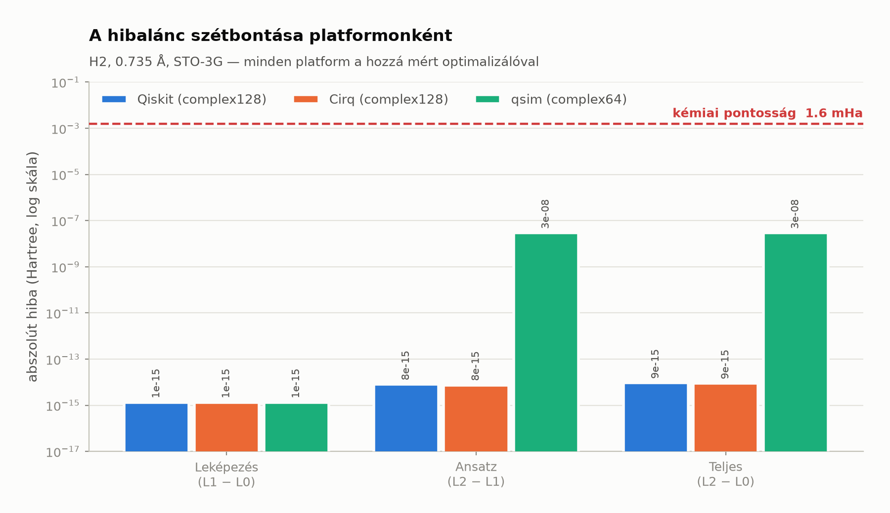
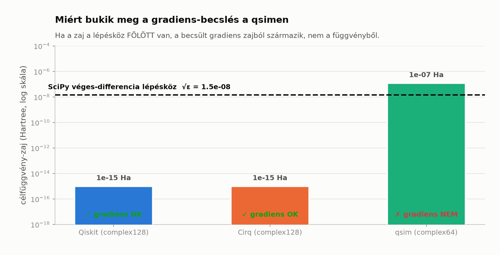
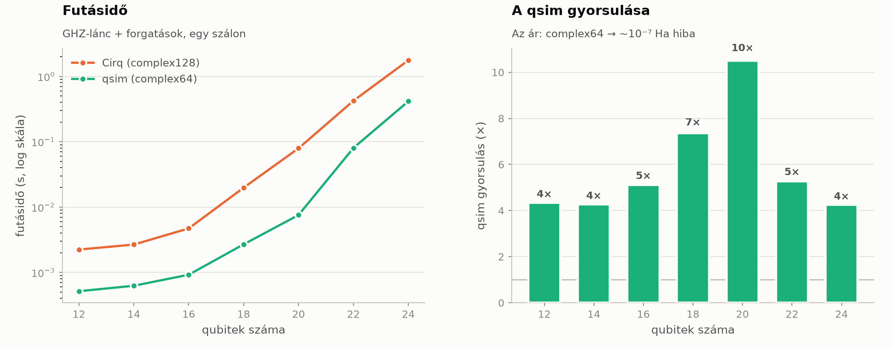
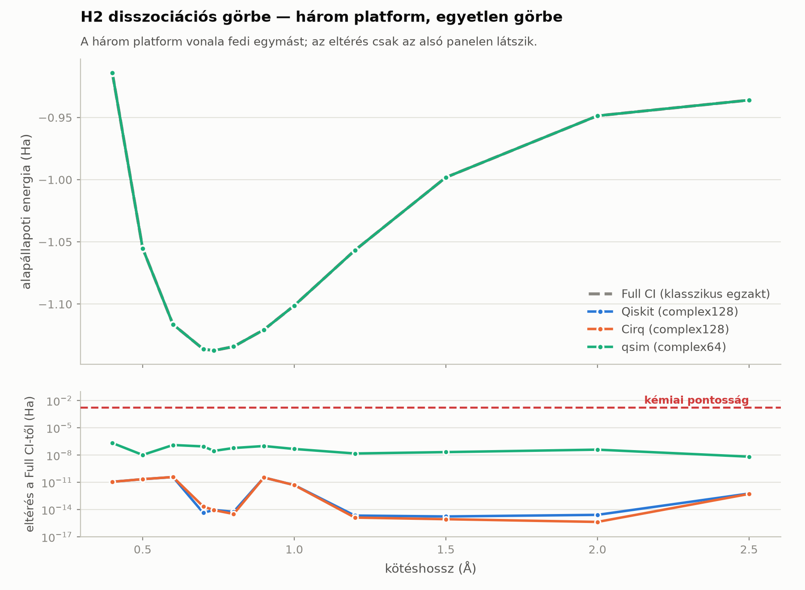

# 01M — Többplatformos validáció: mit ad, és mit nem

| | |
|---|---|
| **Dokumentum** | `docs/01m_multiplatform.md` |
| **Dokumentum-verzió** | 1.0.0 |
| **Dátum** | 2026-09-22 |
| **Projektverzió** | 0.3.0 |
| **Készítők** | Kormos Attila, Claude AI (Anthropic, Claude Opus 5) |
| **Fázis** | 1M — Többplatformos validáció |
| **Döntés** | [ADR-0006](adr/ADR-0006-tobbplatformos-architektura.md) |

---

## 1. A kérdés, amire ez a dokumentum válaszol

> **Hozzájárul-e a pontossághoz és a benchmark értékéhez, ha ugyanazt a feladatot
> több különböző platformon is lefuttatjuk? Miért, és hogyan?**

A válasz **igen, de nem úgy, ahogy elsőre gondolnánk** — és a különbség lényeges.
Ez a dokumentum az őszinte, mért választ adja meg: mit nyerünk vele, mit nem, és
mi volt a konkrét hozadéka a VQEBD-ben.

---

## 2. Amit a többplatformos futtatás **nem** ad

Kezdjük a félreértésekkel, mert ezek a leggyakoribbak.

### 2.1 Nem csökkenti a numerikus hibát átlagolással

Csábító azt gondolni, hogy három platform eredményét átlagolva pontosabb számot
kapunk. **Ez téves.** A platformok hibája nem független, véletlen zaj:

- A Qiskit és a Cirq **ugyanazt** a `complex128` aritmetikát használja, ezért
  a hibájuk erősen korrelált (mért eltérés: **2.2 × 10⁻¹⁵ Ha**).
- A qsim hibája **szisztematikus** (kerekítés `complex64`-re), nem zajszerű.

Átlagolni tehát nemcsak haszontalan, hanem félrevezető is lenne. A helyes
használat: **a legpontosabb platform a referencia**, a többi pedig **ellenőrzés**.

### 2.2 Nem helyettesíti a fizikai referenciát

A három platform egyetértése **nem** bizonyítja, hogy a szám fizikailag helyes.
Ha a Hamilton-operátor hibás, mindhárom platform ugyanazt a hibás számot adja —
egyetértésben.

Ezért marad a **PySCF Full CI (L0)** a végső referencia: az egy **független
elmélet független implementációja**, nem egy negyedik szimulátor.

> **A platform-dimenzió a szimulátor-réteget validálja, nem a fizikát.**
> A fizikát az L0–L1–L2 referencialánc validálja (lásd
> [`docs/01_vqe_core.md`](01_vqe_core.md)).

### 2.3 Nem ingyenes

- Konverziós kód (Qiskit → Cirq), amelyet karbantartani és tesztelni kell.
- Újabb függőségek (`cirq-core`, `qsimcirq`), amelyek verziókorlátokat hoznak —
  a `cirq-core` 1.5.0-tól már `numpy>=1.25`-öt követel, ami majdnem kizárta a
  teljes stacket (ADR-0006).
- Hosszabb tesztfutás.

---

## 3. Amit **ad** — négy konkrét hozadék

### 3.1 Implementációfüggetlenség — a benchmark hitelességének feltétele

Egy benchmark, amelynek eredménye egyetlen könyvtár sajátossága lehet, nem
benchmark. Ha csak Qiskiten mérnénk, a projekt minden állítása így hangzana:
*„a Qiskit szerint az energia −1.137306 Ha."*

Mért egyezés (H2, 0.735 Å, STO-3G):

| Platform | E (Ha) | Eltérés a Qiskittől |
|---|---|---|
| `qiskit_statevector` | −1.137306035753 | referencia |
| `cirq_simulator` | −1.137306035753 | **2.2 × 10⁻¹⁵** |
| `qsim` | −1.137306006762 | 2.9 × 10⁻⁸ |

Két **teljesen különböző kódbázis** (IBM Qiskit és Google Cirq) gépi pontossággal
ugyanazt adja. Ez az állítást így erősíti: *„a fizika szerint az energia
−1.137306 Ha, és ezt két független implementáció megerősíti."*



### 3.2 Hibafelderítés — amit egyetlen platform elrejtene

Ez a legfontosabb hozadék, és itt konkrét bizonyítékunk van.

#### A felfedezés

A Fázis 1M során kiderült, hogy a **gradiens-alapú optimalizálók csendben téves
minimumot találnak** a qsimen. Nem hibával állnak el — „sikeresen konvergálnak",
csak rossz számra.


Mért adatok (H2, hiba a Full CI-hez képest):

| Optimalizáló | Típus | Qiskit | Cirq | **qsim** |
|---|---|---|---|---|
| SLSQP | gradiens | 9 × 10⁻¹⁵ | 9 × 10⁻¹⁵ | **1 × 10⁻² ✗** |
| L-BFGS-B | gradiens | 4 × 10⁻¹⁵ | 9 × 10⁻¹⁶ | 1 × 10⁻⁴ |
| BFGS | gradiens | 2 × 10⁻¹⁵ | 1 × 10⁻¹⁵ | 3 × 10⁻⁴ |
| CG | gradiens | 2 × 10⁻¹⁵ | 1 × 10⁻¹⁵ | 3 × 10⁻⁴ |
| TNC | gradiens | 1 × 10⁻¹³ | 4 × 10⁻¹⁵ | **2 × 10⁻² ✗** |
| COBYLA | deriváltmentes | 4 × 10⁻¹⁵ | 9 × 10⁻¹⁶ | 4 × 10⁻⁷ ✅ |
| Powell | deriváltmentes | 1 × 10⁻¹⁵ | 0 | **3 × 10⁻⁸ ✅** |
| Nelder-Mead | deriváltmentes | 1 × 10⁻¹⁵ | 4 × 10⁻¹⁶ | 1 × 10⁻⁸ ✅ |

*(✗ = kémiai pontosság fölött)*

#### A magyarázat

A gradiens-alapú SciPy-metódusok **véges differenciákkal** becsülnek gradienst:

```
g ≈ [ f(x + h) − f(x) ] / h ,    h = √ε_float64 ≈ 1.49 × 10⁻⁸
```

Ha a célfüggvény zaja nagyobb `h`-nál, a számláló **tisztán zajt** tartalmaz.



Mért érték az optimum közelében:

| Platform | `f(x+h) − f(x)` | Becsült gradiens | Ítélet |
|---|---|---|---|
| qiskit_statevector | +6.66 × 10⁻¹⁶ | +4.47 × 10⁻⁸ | ✅ helyes |
| cirq_simulator | +2.22 × 10⁻¹⁶ | +1.49 × 10⁻⁸ | ✅ helyes |
| **qsim** | **−1.13 × 10⁻⁷** | **−7.61** | ❌ **8 nagyságrend hiba** |

A qsim `complex64` aritmetikájának gépi epszilonja **1.19 × 10⁻⁷** — nagyobb,
mint a véges-differencia lépésköz. A becsült gradiens ezért a kerekítési zajból
származik, nem a függvényből.

#### Miért nem derülhetett volna ki egyetlen platformon

A Qiskiten és a Cirqen **mind a nyolc** optimalizáló hibátlanul működik. Egy
Qiskit-only projekt ezt a hibamódot soha nem látná — egészen addig, amíg a
**Fázis 1b (lövészaj)** vagy a **Fázis 2 (hardverzaj)** elő nem hozza. Ott
viszont már IBM-kvótát égetve derülne ki, hogy a „konvergált" futás rossz számot
adott.

> **Ez a többplatformos vizsgálat konkrét, számszerű hozadéka:** egy csendes
> hibamód felderítése, kvótamentesen, két fázissal azelőtt, hogy kárt okozna.

#### Amit ebből beépítettünk

A felfedezés nem maradt dokumentációs lábjegyzet:

1. A :mod:`vqebd.platforms` modul minden platformhoz **mért zajszintet** tárol.
2. A `gradient_safe` tulajdonság ebből **számítja**, nem vélekedésből.
3. Minden platformnak van **mért** ajánlott optimalizálója.
4. A `run_vqe()` **figyelmeztetést ad**, ha veszélyes kombinációt kap:

```
RuntimeWarning: a(z) 'SLSQP' gradiens-alapú optimalizáló a(z) 'qsim' platformon
MEGBÍZHATATLAN: a célfüggvény zajszintje (1.2e-07 Ha) 8-szerese a SciPy
véges-differencia lépésközének (1.49e-08), ezért a becsült gradiens zajból
származik. Az optimalizáló CSENDBEN téves minimumot találhat.
Ajánlott helyette: 'Powell' vagy más deriváltmentes módszer.
```

### 3.3 Kvótavédelem

Az IBM Open Plan kvótája **10 perc QPU-idő / 28 nap**. Egyetlen hibás
áramkör-konstrukció, amely csak hardveren derül ki, elégetheti a keretet.

A Fázis 1M két **kvótamentes** platformot ad, amelyeken a hardveres kódút
próbálható. A Fázis 2 így nem hibakereséssel kezdődik.

### 3.4 Skálázás — a nagyobb molekulák előkészítése

A qsim ára a pontosság, haszna a sebesség:



Mért értékek (GHZ-lánc + forgatások, egy szálon, **3 ismétlésből a legrövidebb**):

| Qubit | `cirq.Simulator` | `qsim` | Gyorsulás |
|---|---|---|---|
| 12 | 0.0024 s | 0.0006 s | 4.2× |
| 14 | 0.0032 s | 0.0006 s | 5.1× |
| 16 | 0.0046 s | 0.0009 s | 4.9× |
| 18 | 0.0201 s | 0.0023 s | 8.9× |
| 20 | 0.0747 s | 0.0082 s | 9.1× |
| 22 | 0.3703 s | 0.1039 s | 3.6× |
| **24** | **2.2274 s** | **0.4697 s** | **4.7×** |

> **Módszertani megjegyzés — egy korrigált állítás.** Egy korábbi, **egyszeri**
> mérés 24 qubiten 22-szeres gyorsulást mutatott. Ez **nem volt reprodukálható**:
> ismételt méréssel (min-of-3) a tartomány **3.6–9.1×**. Az időmérés zajos, és a
> zaj csak hozzáadni tud, elvenni nem — ezért a **minimum** a torzítatlan becslés,
> és ezért kell ismételni. A korábbi szám egyetlen, hideg gyorsítótárú futásból
> származott. A jegyzékben a reprodukálható érték szerepel.

A Fázis 5 molekulái (LiH 10–12 qubit, BeH2 12–14 qubit) ebben a tartományban
vannak. A qsim ~10⁻⁷ Ha hibája **négy nagyságrenddel** a kémiai pontosság
(1.59 × 10⁻³ Ha) alatt marad, tehát a fizikai következtetést nem befolyásolja.

---

## 4. Hogyan — a módszertan

### 4.1 Egyetlen forrás, három kiértékelő

A kísérleti elrendezés kulcsa, hogy a **fizikai feladat egyetlen helyen
születik**, és onnan konvertálódik:

```
        PySCF + Qiskit Nature   (a feladat EGYETLEN definíciója)
                 │
        SparsePauliOp          QuantumCircuit (UCCSD)
                 │                      │
          to_cirq_pauli_sum()     to_cirq_circuit()
                 │                      │
     ┌───────────┴──────────────────────┴───────────┐
     ▼                    ▼                          ▼
qiskit_statevector   cirq_simulator                qsim
  complex128           complex128                complex64
```

**Miért nem független kémiával mindkét oldalon?** Mert akkor egy eltérésről nem
tudnánk megmondani, hogy a szimulátor vagy a Hamilton-operátor okozta. Az azonos
bemenet **kísérleti kontroll**, nem hiányosság: így az eltérés egyetlen
változóra, a szimulátorra vezethető vissza.

*(Az `openfermion`-alapú, teljesen független kémiai út egyébként sem
illeszthető: az 1.8.1 `cirq-core>=1.6.0`-t követel, az pedig `numpy~=2.1`-et —
ütközik az ADR-0001 stackkel.)*

### 4.2 A konverzió mátrixszinten validált — nem energiaszinten

Ez módszertanilag a legfontosabb döntés.

A legveszélyesebb konverziós hiba a **qubit-sorrend (endianness)**: a Qiskit
little-endian, a Cirq a `qubit_order` elejét tekinti legnagyobb helyiértékűnek.

Mért bizonyíték (H2, 2 qubit, 5 Pauli-tag):

| `PauliSum.matrix()` sorrendje | `max\|M_cirq − M_qiskit\|` |
|---|---|
| `[q0, q1]` (egyenes) | **1.59** ❌ |
| `[q1, q0]` (**fordított**) | **0.00 × 10⁰** ✅ |

**Miért nem elég az energia-összehasonlítás?** Mert egy szimmetrikus
Hamilton-operátoron a rossz sorrend **véletlenül helyes energiát is adhat**. A
hiba csak egy aszimmetrikus rendszernél (LiH, BeH2 — Fázis 5) bukna ki, amikor
már a teljes batch-infrastruktúra rá épül.

A teszt ezért **kétirányú**:

1. a helyes sorrend mátrixa **egyezik** (`< 1e-12`);
2. a helytelen sorrend mátrixa **kimutathatóan eltér** (`> 1e-6`) — enélkül az
   első állítás triviálisan teljesülne, és semmit nem bizonyítana.

### 4.3 Platformonkénti tolerancia — a számábrázolásból levezetve

A tolerancia nem „ami éppen átmegy", hanem a platform aritmetikájából következik:

| Platform | Aritmetika | Gépi ε | Tolerancia | Kémiai pontosság alatt |
|---|---|---|---|---|
| qiskit_statevector | complex128 | 2.2 × 10⁻¹⁶ | 1 × 10⁻⁹ Ha | 1 593 000× |
| cirq_simulator | complex128 | 2.2 × 10⁻¹⁶ | 1 × 10⁻⁹ Ha | 1 593 000× |
| qsim | **complex64** | **1.2 × 10⁻⁷** | 1 × 10⁻⁵ Ha | **159×** |

Mindhárom nagyságrendekkel a kémiai pontosság alatt marad.

### 4.4 Fizikai keresztvalidáció eltérő geometriákon

A 0.735 Å-ös H2 Hamilton-operátora viszonylag szimmetrikus. A disszociációs
görbe **eltérő szerkezetű** operátorokat vizsgál, így egy esetleges
sorrendhiba nagyobb eséllyel bukik ki.



A felső panelen a három görbe **fedi egymást** — az eltérés csak az alsó, log
skálájú panelen látszik, és ott is végig a kémiai pontosság alatt marad.

---

## 5. Összefoglaló mérleg

| Szempont | Hozzájárul? | Bizonyíték |
|---|---|---|
| **Numerikus pontosság javítása** | ❌ Nem | A hibák korreláltak (Qiskit ↔ Cirq: 2.2 × 10⁻¹⁵); átlagolni félrevezető. |
| **A szám helyességébe vetett bizalom** | ✅ **Igen** | Két független kódbázis gépi pontossággal egyezik. |
| **Rejtett hibamódok felderítése** | ✅ **Igen, bizonyítottan** | Az optimalizáló × pontosság kölcsönhatás (3.2) csak így derült ki. |
| **Fizikai helyesség igazolása** | ❌ Nem | Ezt az L0 (PySCF Full CI) adja, nem egy negyedik szimulátor. |
| **Kvótavédelem** | ✅ Igen | Két kvótamentes platform a Fázis 2 előtt. |
| **Skálázás nagyobb rendszerekre** | ✅ Igen | qsim: 4–9× gyorsulás (mért, min-of-3 ismétlés, 12–24 qubit). |
| **Karbantartási teher** | ⚠️ Van | Konverziós kód + két függőség + hosszabb tesztfutás. |

### A lényeg egy mondatban

> A többplatformos futtatás **nem pontosabb számot** ad, hanem **megbízhatóbb
> tudást arról, hogy a szám helyes-e** — és olyan hibamódokat derít fel, amelyek
> egyetlen platformon csendben maradnának.

---

## 6. Használat

```bash
# Mindhárom platform, a hozzájuk mért optimalizálóval
docker run --rm vqebd:0.3.0 python -m vqebd --backend qiskit_statevector
docker run --rm vqebd:0.3.0 python -m vqebd --backend cirq_simulator
docker run --rm vqebd:0.3.0 python -m vqebd --backend qsim --optimizer Powell

# Az ábrák újragenerálása a tényleges mérésekből
docker run --rm -v "$PWD:/repo" -w /repo vqebd:0.3.0 \
    python scripts/gen_report_figures.py
```

Python API-ként:

```python
from vqebd.chemistry.molecule import h2
from vqebd.config import OptimizerSpec, VQEConfig
from vqebd.platforms import platform_of
from vqebd.vqe.runner import run_vqe

for backend in ("qiskit_statevector", "cirq_simulator", "qsim"):
    info = platform_of(backend)
    result = run_vqe(
        VQEConfig(
            molecule=h2(0.735),
            backend=backend,
            # A platformhoz MÉRT optimalizálót használjuk
            optimizer=OptimizerSpec(method=info.recommended_optimizer),
        )
    )
    print(f"{backend:<20} {result.energy:.12f} Ha  ({info.precision})")
```

---

## 7. Következő lépés

**Fázis 1b** — zajos szimuláció. A most felfedezett optimalizáló × zaj
kölcsönhatás ott **fokozottan** jelentkezik: a lövészaj nagyságrendekkel nagyobb
a `complex64` kerekítési zajnál. A Fázis 1M eredménye tehát közvetlenül
előkészíti a Fázis 1b optimalizáló-választását.

---

## 8. Változásnapló

| Verzió | Dátum | Változás |
|---|---|---|
| 1.0.0 | 2026-09-22 | Első kiadás (Fázis 1M). |

---

*Készítők: Kormos Attila, Claude AI (Anthropic, Claude Opus 5) — MIT licenc*
